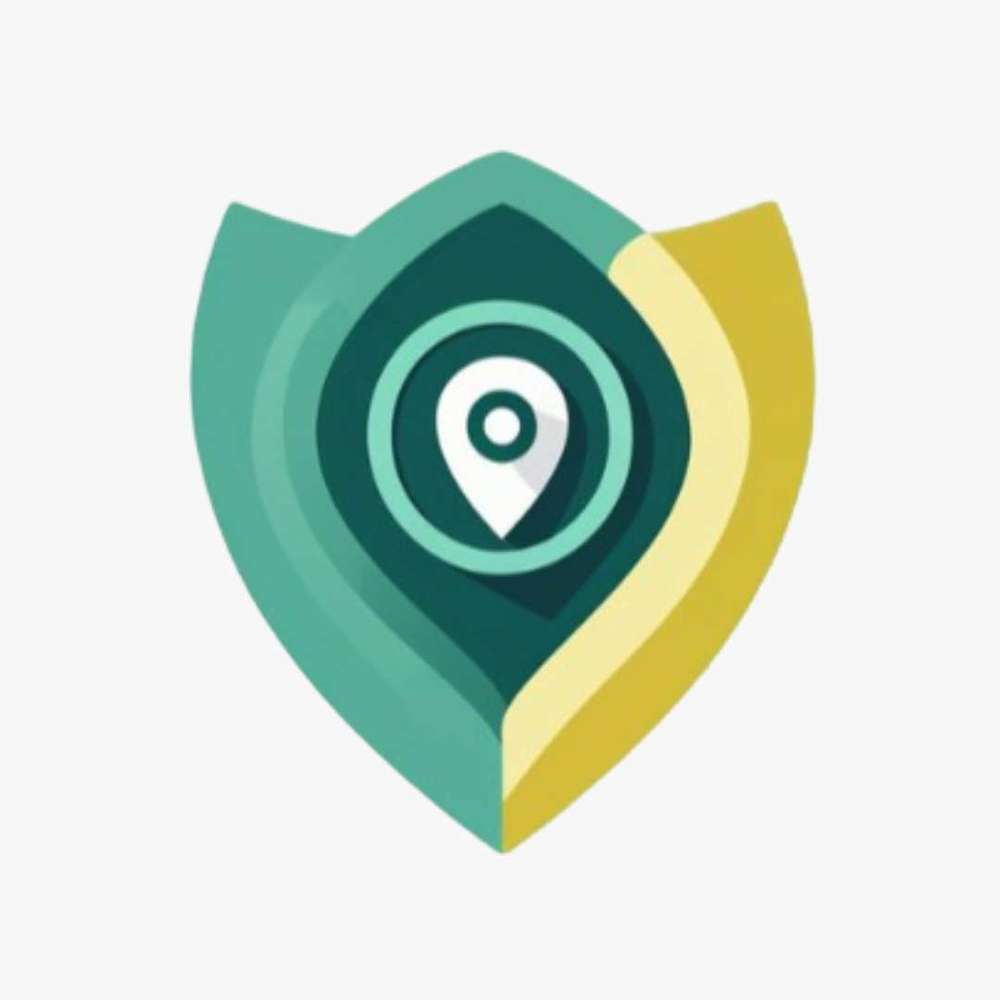

🛰️ SafeMap - Emergency Coordination & Safe Routing Platform
SafeMap is a web platform designed to improve emergency response by connecting citizens, municipalities, volunteers, and ISU (emergency authorities) through real‑time hazard reporting, shelter information, and safe‑route navigation.

Built during the Polihack Hackathon 2025 , where it ranked 5th in the Web category 

🚨 Key-Features
For Citizens
Real‑time map of hazards (floods, fires, blocked roads, etc.)

Safe routes to the closest verified shelter

Google Maps redirection from map points

For Volunteers / NGOs
Add and manage shelters

Update shelter capacity

Retrieve exact coordinates through “Get My Location”

Manage availability

For Municipalities / ISU
Validate hazard reports

Monitor citizen‑generated alerts

Coordinate shelters and volunteers

Centralized dashboard for emergency management

🗺️ Map System
Built using Leaflet.js

Displays citizen hazards, shelters, and user location

Routing powered by OSRM via a Node.js backend

Click any shelter/marker to open its location in Google Maps

🏗️ Tech Stack

Frontend

React + TypeScript

Vite

React‑Leaflet

Material UI (MUI)

Backend

Node.js + Express

OSRM routing service

REST API for safe places

Other

GeoJSON for route rendering

Browser geolocation API

📦 Installation
1. Clone repo
git clone https://github.com/andreimocian/Polihack.git
cd Polihack

2. Install frontend
cd frontend
cd safemap-frontend
npm install
npm run dev

3. Install backend
cd backend
npm install
npm start

🔧 Environment Variables
Create a .env in /backend:
PORT=3000
OSRM_URL=http://router.project-osrm.org/

🚀 Running SafeMap
Open two terminals:
Frontend
npm run dev

Backend
npm start

Your app will be live at: 
http://localhost:5173

🧭 Project Structure
/frontend
  /src
    /components
    /services
    /utils
    /types
/backend
  /routes
  /controllers
  /services

🌍 Go‑To‑Market Vision
Pilot in high‑risk municipalities

Expand to one ISU county unit

Scale across Romania

Long‑term: national ISU adoption

🤝 Team
Emma‑Daria Ghiță - Research & Pitch

Maria Moruțan - Frontend & Design

Mocian Andrei - Backend

David Rafael Rotar - Integration & Mapping

📄 License
Free to use, modify and build upon.
